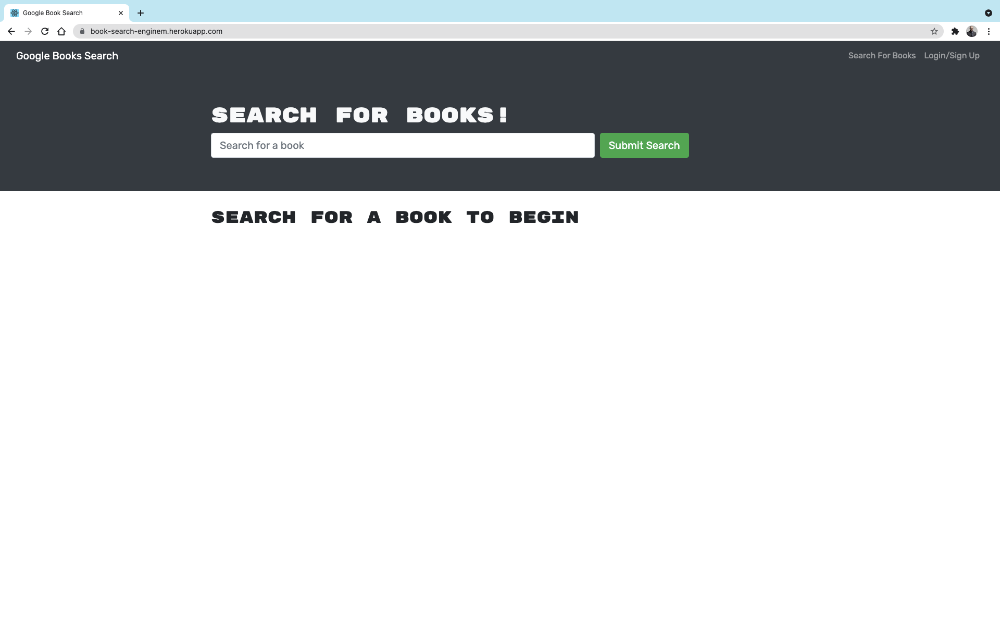
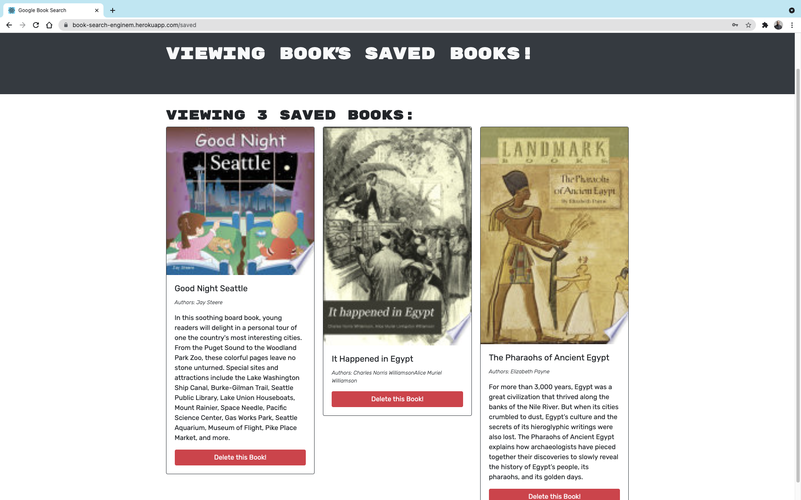

# Book Search Engine
An application that search for new books to read, save and to keep a list of books to purchase.

## About
Fully functioning Google Books API search engine built with GraphQL API and Apollo Server. The app was built using the MERN stack with a React front end, MongoDB database, and Node.js/Express.js server.
- First when user visits the page, he/she can search a book which will then return a list of books available in google.
- Then user will be given option to save the book or if book is already saved the button text will change to 'Book already saved'
- Then when user saves the books they can visit 'See your Books' tab to get the list of saved books.
- From here user can delete the book from the list.

## Table of Contents
* [Installation](#installation)
* [User-Stroy](#User-Story)
* [Screen-Shots](#Screen-Shots)

## Installation
<!-- TODO: add the live Heroku link -->
- You can visit the deployed app here : [Book Search Engine](https://book-search-enginem.herokuapp.com/).
- If you want to run the app on your local server download it through Github.
- Run npm i or (npm install), to make sure to download all the necessary files in the jason package.
- In your command shell run npm start.

## User Story

```md
AS AN avid reader
I WANT to search for new books to read
SO THAT I can keep a list of books to purchase
```
<!-- TODO: add correct screenshot -->
### Screen Shots



